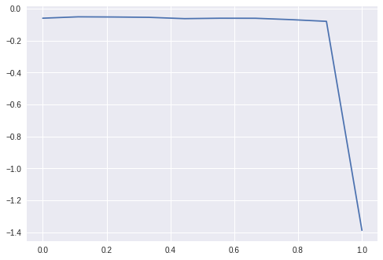
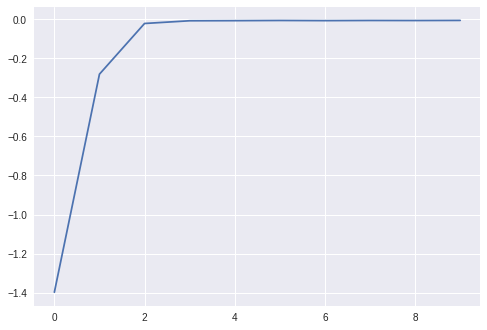

# CSCI-GA.3033-022
NYU CIMS 'Deep Generative Models' course

https://cs.nyu.edu/courses/spring18/CSCI-GA.3033-022/

## Final Project - Numerical Tests

The aim is to understand if sub-optimal discriminator in GANs define a meaning-ful distance between two distributions.
We generated two sets of Gaussian distributions. The first set consists of one fixed distribution P.
The second set consists of a collection of distributions Q_i approaching P in some sense.
For each Q_i we train a classic GAN discriminator (250 rounds, with L2 regularization) and we report the loss.

### Test 1

In this case P is taken to be a d-dimensional standard Gaussian distribution projected on the vector e_1.
Q_i is taken to be a d-dimensional standard Gaussian distribution projected on a unit vector v_i.
The vectors v_i converge to e_1 as i increases (in particular <e_1,v_i> is an increasing function in i). 
The plot below reports the loss as a function of i.

Here i belongs to {0.,0.1,...,0.9,1.} The distribution P and Q_i have not perfectly aligned supports for i < 1. In this case the divergence is not capable to see any differences between the different distributions. The distance is minimized for Q=P (i=1.).

### Test 2

In this case P is taken to be a d-dimensional standard Gaussian distribution with mean mu=0.
Q_i is taken to be a d-dimensional standard Gaussian distribution with mean mu_i=i, for i in {0.,1.,...,9.}.
The plot below reports the loss as a function of i.

### Conclusion

